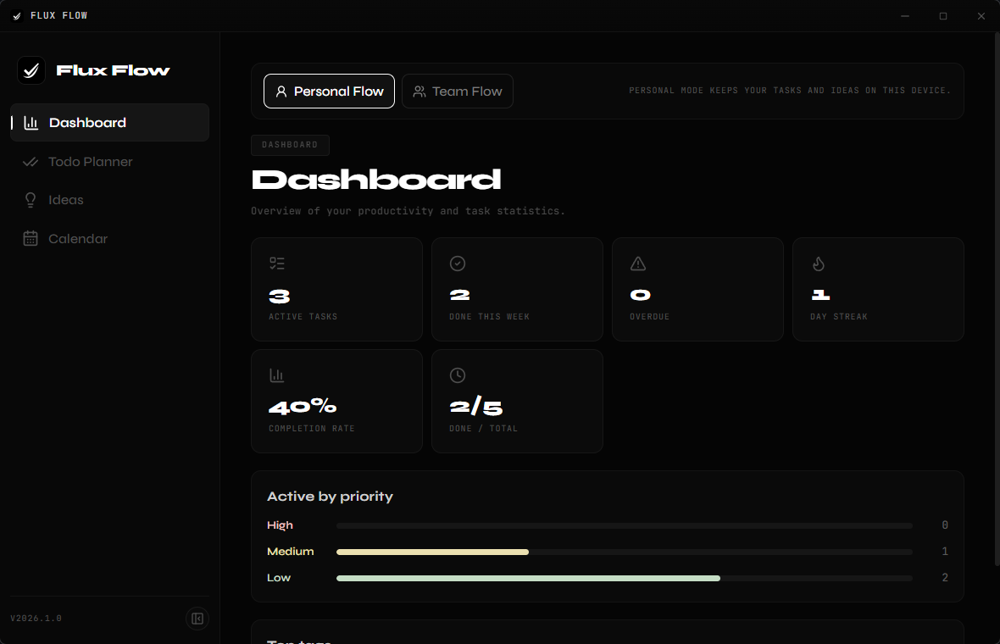

# Flux-Flow

Desktop productivity app built with **Tauri + React + Rust** for managing TODOs and ideas in two modes:

- **Personal Flow**: local data on your device (`~/.flux-flow`).
- **Team Flow**: shared data through a Rust backend API.

## Preview



## Features

- TODO planner with priority, tags, reminders, due dates
- Ideas list with convert-to-TODO
- Calendar + dashboard views
- Team create/join by code
- Session token authentication for Team API (Bearer token)
- Team roles: **Owner / Admin / Member**
- Task assignee support in team mode
- Owner-only activity feed

## Team Permissions

- **Owner**
  - can change member roles (Admin/Member)
  - can view activity feed
  - can manage all tasks
- **Admin**
  - can manage all tasks
- **Member**
  - can manage only tasks they created or tasks assigned to them

## Project Structure

- `src/` React frontend
- `src-tauri/` Tauri shell + local/personal storage + Team API bridge
- `backend/` Rust Axum backend for Team Flow

## Requirements

- Node.js 18+
- npm
- Rust stable (`rustup`)
- Tauri prerequisites (platform-specific): https://tauri.app/start/prerequisites/

## Quick Start (Development)

1. Install frontend dependencies:

```bash
npm install
```

2. Start backend (terminal #1):

```bash
cd backend
cargo run --release
```

3. Start app (terminal #2):

```bash
npm run tauri:dev
```

## Build

Frontend build:

```bash
npm run build
```

Desktop app build:

```bash
npm run tauri:build
```

## Backend Configuration

Backend env vars:

- `FLUX_FLOW_TEAM_BIND_ADDR` (default: `0.0.0.0:25578`)
- `FLUX_FLOW_TEAM_DB_PATH` (default: `backend.json`)

Tauri Team backend URL env var:

- `FLUX_FLOW_TEAM_BACKEND_URL`

By default, Tauri currently points to:

- `http://127.0.0.1:25578`

For production/remote backend, set:

```powershell
$env:FLUX_FLOW_TEAM_BACKEND_URL="http://your-server:25578"
```

## Backend API (Team Flow)

Protected endpoints use:

- `Authorization: Bearer <auth_token>`

- `GET /health`
- `POST /api/team/create`
- `POST /api/team/join`
- `GET /api/team/{team_code}/context`
- `GET /api/team/{team_code}/activity` (owner only)
- `GET /api/team/{team_code}/todos`
- `PUT /api/team/{team_code}/todos`
- `GET /api/team/{team_code}/ideas`
- `PUT /api/team/{team_code}/ideas`
- `PUT /api/team/{team_code}/members/{target_member_id}/role`

## Notes

- Personal mode and team mode are intentionally separated.
- Team operations require backend availability.
